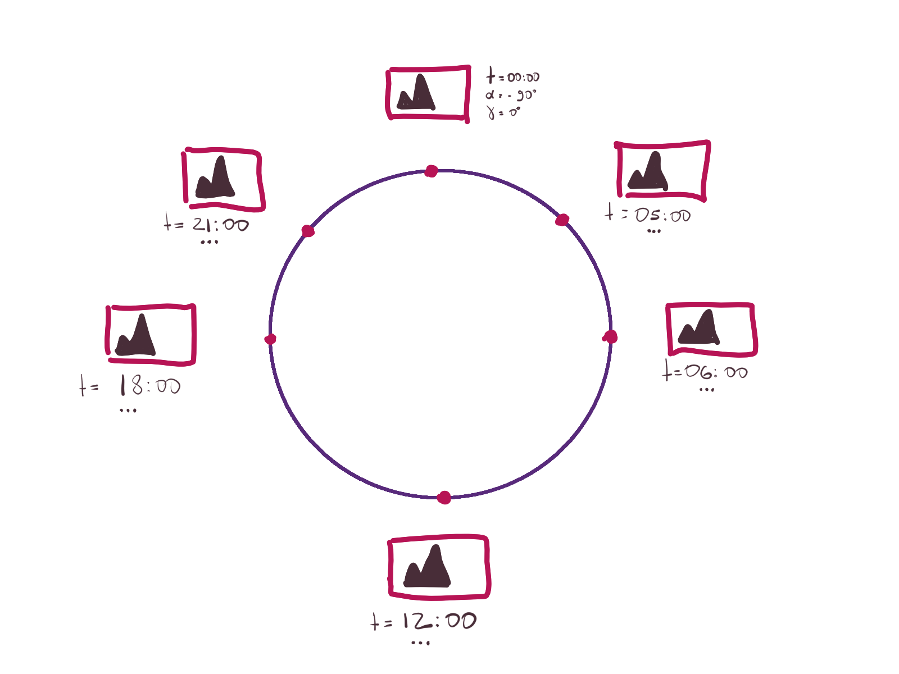

<!--
SPDX-FileCopyrightText: none

SPDX-License-Identifier: CC0-1.0
-->

# Dynamic Wallpaper Engine

**NOTE**: The master branch contains the next major version of this plugin, which uses
the AVIF file format instead of HEIF and it's still in development. If you want to build
this plugin from source code, checkout 3.3.9 tag!

A wallpaper plugin for KDE Plasma that continuously updates the desktop background
based on the current time in your location.


## Additional Wallpapers

More dynamic wallpapers can be found at https://github.com/karmanyaahm/awesome-plasma5-dynamic-wallpapers.


## Installation

#### Arch Linux

```
yay -S plasma5-wallpapers-dynamic
```

#### Fedora

```
sudo dnf install plasma-wallpapers-dynamic
```

In order to use the dynamic wallpaper builder tool, install `plasma-wallpapers-dynamic-builder` package.

#### Ubuntu 20.10

```
sudo apt install plasma-wallpaper-dynamic
```


## Building From Git

In order to build this wallpaper plugin from source code, you need to install a
couple of prerequisites

Arch Linux:

```sh
sudo pacman -S cmake extra-cmake-modules git plasma-framework qt5-base qt5-declarative \
    qt5-location libexif libavif
```

Fedora:

```sh
sudo dnf install cmake extra-cmake-modules git kf5-kpackage-devel kf5-plasma-devel \
    kf5-ki18n-devel qt5-qtbase-devel qt5-qtdeclarative-devel qt5-qtlocation-devel \
    libexif-devel libavif-devel
```

Ubuntu:

```sh
sudo apt install cmake extra-cmake-modules git libkf5package-dev libkf5plasma-dev \
    libkf5i18n-dev qtbase5-dev qtdeclarative5-dev qtpositioning5-dev gettext \
    qml-module-qtpositioning libexif-dev libavif-dev build-essential
```

Once all prerequisites are installed, you need to grab the source code

```sh
git clone https://github.com/zzag/plasma5-wallpapers-dynamic.git
cd plasma5-wallpapers-dynamic
```

Configure the build

```sh
mkdir build && cd build
cmake .. -DCMAKE_BUILD_TYPE=Release \
    -DCMAKE_INSTALL_PREFIX=/usr \
    -DCMAKE_INSTALL_LIBDIR=lib \
    -DBUILD_TESTING=OFF
```

Now trigger the build by running the following command

```sh
make
```

To install run

```sh
sudo make install
```


## How to Use It

Right-click a blank area of the desktop and choose "Configure Desktop...", select
"Dynamic" wallpaper type and click the Apply button.


## How to Create a Dynamic Wallpaper

The `kdynamicwallpaperbuilder` command line tool is used to create dynamic wallpapers. As input,
it takes a manifest json file describing the wallpaper and produces the wallpaper

```sh
kdynamicwallpaperbuilder path/to/manifest.json --output wallpaper.avif
```

This engine supports several types of dynamic wallpapers - solar and day-night.

#### How to Create a Solar Dynamic Wallpaper

With a solar dynamic wallpaper, the engine will try to keep the images in sync with the Sun
position at your location.

<center>
    
</center>

The manifest file looks as follows

```json
{
    "Type": "solar",
    "Meta": [
        {
            "SolarAzimuth": "*",
            "SolarElevation": "*",
            "CrossFade": true,
            "Time": "18:00",
            "FileName": "0.png"
        },
        {
            "SolarAzimuth": 0,
            "SolarElevation": -90,
            "CrossFade": true,
            "Time": "00:00",
            "FileName": "1.png"
        },
        {
            "SolarAzimuth": 90,
            "SolarElevation": 0,
            "CrossFade": true,
            "Time": "06:00",
            "FileName": "2.png"
        },
        {
            "SolarAzimuth": 180,
            "SolarElevation": 90,
            "CrossFade": true,
            "Time": "12:00",
            "FileName": "3.png"
        }
    ]
}
```

It might look like you must provide a lot of data, but don't be scared. Let's break it down.

The `SolarAzimuth` field and the `SolarElevation` field specify the position of the Sun when the
associated picture was taken. The `Time` field specifies the time, which is in 24-hour format, when
the picture was taken. If the user is not located near the North or the South Pole, the dynamic
wallpaper engine will try to show images based on the current position of the Sun; otherwise it will
fallback to using time metadata. Note that only the `Time` field is required, the position of the
Sun is optional.

If `SolarAzimuth` or `SolarElevation` has a special value of `"*"`, then the position of the Sun
will be computed based on the time when the picture was taken and the GPS coordinates stored in
its Exif metadata.

The `CrossFade` field indicates whether the current image can be blended with the next one. The
cross-fading is used to make transitions between images smooth. By default, the `CrossFade` field is
set to `true`. Last, but not least, the `FileName` field specifies the file path of the image
relative to the manifest json file.

Now that you have prepared all images and a manifest file, it's time pull out big guns. Run the
following command

```sh
kdynamicwallpaperbuilder path/to/manifest.json
```

It may take some time before the command completes, so be patient. If everything goes well, you
should see a new file in the current working directory `wallpaper.avif`, which can be used as a
dynamic wallpaper.

#### How to Create a Day/Night Dynamic Wallpaper

A day/night dynamic wallpaper consists of only two images - one for the day, and one for the night.
The engine will automagically figure out which one to use based on the current time or the Sun
position at your location.

The manifest file for a day/night wallpaper looks as follows

```sh
{
    "Type": "day-night",
    "Meta": [
        {
            "TimeOfDay": "day",
            "FileName": "day.png"
        },
        {
            "TimeOfDay": "night",
            "FileName": "night.png"
        }
    ]
}
```


## How to Use Dynamic Wallpapers for macOS

Since dynamic wallpapers for macOS and this plugin are incompatible, you need to use a script to
convert dynamic wallpapers.

```sh
curl https://git.io/JJkjd -sL > dynamicwallpaperconverter
chmod +x dynamicwallpaperconverter
```

Once you've downloaded the dynamicwallpaperconverter script, you can start converting wallpapers

```sh
./dynamicwallpaperconverter --crossfade file.avif
```

After the command above has finished its execution, you should see a file in the current working
directory named 'wallpaper.avif', which can be fed into this plugin.
